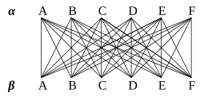

# Planetary systems, or Double duet for the Outside of Time (2022)

それぞれ六つの惑星からなる二つの惑星系がある。惑星間の移動は（何故か）必ず相手方の惑星系へ向かうものとし、同じ惑星系内部での移動を認めない。この状況をグラフで描くと左図のようになる。全ての惑星から延びる航路の数が6本、即ち偶数であるため、一筆書きによって36本全ての航路を巡ることができる（＝オイラーグラフ）。この一筆書きを音楽に置き換えたものが本作の第1部である。バス・フルートとバス・クラリネットは、それぞれ惑星系αとβを表し、各惑星系の六つの惑星A~Fは6種類の音楽に置き換えられる。初めに船はα-A星を発ってβ-F星に向かう。この場合、バス・フルートは音楽Aを、バス・クラリネットは音楽Fを奏する。次に船がα-B星に向かうと、バス・フルートが音楽Bを奏する。以下同様に航行することで、36通り全ての音楽の組み合わせが現れる。

幾つかの問題は節点Nodeと辺Edgeからなるグラフ構造に置き換えることが可能であり、総音程音列の探索もまた同様である。その結果は作品の第2部で示される。奏者らは、各自の携帯端末で再生する動画に従って演奏するが、その動画には音声も含まれており「各々16の惑星からなる二つの惑星系を一筆書きで往復する」要領で音楽を形成する。よって本作は同時進行する二つの二重奏から成る。

時間軸に沿って展開することから、音楽は時間芸術であると言われる。時間芸術の概念は「空間が画家の領域であるように、時間の連続（時間的順序）が詩人の領域であることに変わりはない」と記したレッシングに始まるとされる(Lessing 1766)。聴衆はいつでも（実演の音であれ、録音された過去の音であれ）只今現在聴こえている音しか聴くことができない。いま鳴っている音と、過去に鳴った音とを、同時に聴くことはできないにも関わらず、どうして聴衆は音楽を音楽として聴くことができるのか。アウグスティヌスによれば、それは我々の意識が記憶と予測の機能を備えているからである(Augustine of Hippo 397-398)。過去は既に存在しないものであり、未来は未だ存在しないものである。ただ現在のみが存在する。しかしながら我々は記憶と予測を通じて過去と未来を認識できる。言わば過去も未来も丸ごと現在の中に存在する。従って時間とは、あくまで主観的な感覚として、我々の精神の中にのみ存在する。後代、絶対空間と併せて絶対時間を主張したニュートンに対抗して、時間とは出来事の連続に他ならず、出来事から独立して存在するものではないとライプニッツは反論している。当時の人々にとってニュートンの絶対時間は斬新過ぎるアイディアだったが、現代人の大多数は概ねこの時間観を受け入れているようだ。ニュートンの絶対時間は相対性理論以降の物理学においては既に居場所を失っているのだが。さて時間芸術としての音楽が拠って立つはずの、時間なるものの存在がこれほど不確実であることについて、音楽家はどう考えるべきだろうか。

物理学における時間はさておき、あくまで我々の感覚に基づく、実生活における時間に話を限るとしても、音楽が時間芸術であるとは果たして何を意味するのか。時間とは単一かつ有限であり、始点と終点を有する線分のようなものである（神だけが無限である）というキリスト教の世界観の下に育まれた西洋音楽は、世界的にも特異な「書かれる（作曲される）音楽」であることからも、共通のテンポと有限の演奏時間を前提とするように思える。予め与えられた線分的時間の中で、様々に時間的発展を繰り広げるのが一般的な（西洋）音楽のあり方と考えられる。これらの音楽が体現している時間観が、却って我々の認識の枠組みを規定し、あるいは他の時間観を排除するおそれはないのだろうか。

音楽から時間を取り除くということを最初に考えたのは、恐らくクセナキスである。音楽のアーキテクチャ（根源的論理構造）は時間外・時間内・一時的の三つに分類できる。例えば音程は、水平に配置しても（＝旋律）、垂直に配置しても（＝和音）、その構造は不変なので時間的順序によって変質しない「時間外のアーキテクチャ」である。そして音程や音高など、時間外のアーキテクチャを時間軸上に展開したものが実際の音楽である(Xenakis 1963)。クセナキスは我々のものの見方を規定している時間と空間の概念を変革することを説いているが、実際の音楽作品から時間を排除することまでは検討しなかったようである。

アウグスティヌスに立ち返れば、時間とは結局のところ人の精神の作用に他ならず、絶対でも不変でもない。にも関わらず「万人にとって時間は平等である」などのプロパガンダが為されるのは、いかなるイデオロギーに基づくものだろうか。常日頃、我々は記譜や何らかのインターフェイスを通じて、時間をあたかも線分的に扱っているが、音楽鑑賞の経験が齎すものは線分的時間とは全く異質の、凹凸のある時間感覚である。だからこそ2時間半の演奏会を体感的に90分と誤解するといった事が起こる。神経多様性Neurodiversityの概念に依れば、脳のあり方とは人それぞれであり、畢竟、時間の様態も人それぞれである。線分的時間であれ円環的時間であれ、幾何学化された時間概念とは個々の人間にとっては外から押し付けられた認識の牢獄以外の何ものでもない。

作業記憶Working memoryとは何らかの作業に必要とされる一時的な記憶能力を指す。音楽の鑑賞に当てはめれば近過去の音を一時的に保持し都度参照するためのバッファ領域を指すだろう。作業記憶の不足など、何らかの障害によって音楽を音楽として認識できないなどの例については、例えば山本精一(山本 1999)やオリヴァー・サックス(Sacks 2007)から知ることができる。限られた素材やパターンの使用によって、ある程度この問題を回避することができるかもしれない。サックスはまた、病によって数秒の記憶しか保持できなくなった人物が、演奏能力については全く支障なく発揮できるという事例も記している。我々が通常、瞬間ごとの自らの姿勢について一々考えずとも階段を昇り降りできるのと同様に、演奏行為が一連の動作として統合されているためと考えられる。極論すれば、演奏行為において時間の概念は必須ではないのだと、この例からは言えそうである。他方、協調運動に困難を持つ人間にとって演奏行為は至難の業である。静止画を繋ぎ合わせて動画を作るように、瞬間ごとの姿勢を繋ぎ合わせても正常な動作にはならない。ある動作が次の動作を呼び出すフィードバック回路が必要である。こうして統合された動作は、複数の感覚器からの入力に応じて複雑に分岐する状態遷移図として表現できる。状態遷移図もまた節点と辺によって表現されるグラフ構造である。

データ構造としてのグラフが表すのは、複数の事物の関係であり、事物の間の時間的順序や持続といった要素は必須ではない。グラフには時間が存在しない。グラフによって構成された作品は、起承転結などの目的論的時間構造を持たない。どの構成も、グラフに含まれる膨大な経路のうちのただ一つに過ぎないからだ。むしろ恣意的に選択されたある一つの経路が、他の全ての経路に代わってグラフの構造を示す。次の問題は、そうした無目的を置いておく余地を我々の周囲に確保できるか否かである。

#### 参考
- [Gotthold Ephraim Lessing, Laokoon oder Über die Grenzen der Malerei und Poesie, 1766](https://www.gutenberg.org/files/6889/6889-8.txt)
- カルロ・ロヴェッリ『時間は存在しない』冨永星(訳)、NHK出版、2019
- ヤニス・クセナキス『形式化された音楽』野々村禎彦(監訳)、冨永星(訳)、筑摩書房、2017
- 山本精一『ギンガ』リットーミュージック、1999
- オリヴァー・サックス『音楽嗜好症(ミュージコフィリア)―脳神経科医と音楽に憑かれた人々』大田直子(訳)、早川書房、2010

#### 編成
Bass flute and Bass clarinet, with Two video-scores which embedded soundtrack

#### 委嘱
蛍光資料

#### 初演
2022年12月7日、五反田文化センター 音楽ホール、梶原一紘・岩瀬龍太

---
*Copyright © 2022 Takumi Ikeda All Rights Reserved. 禁無断転載*